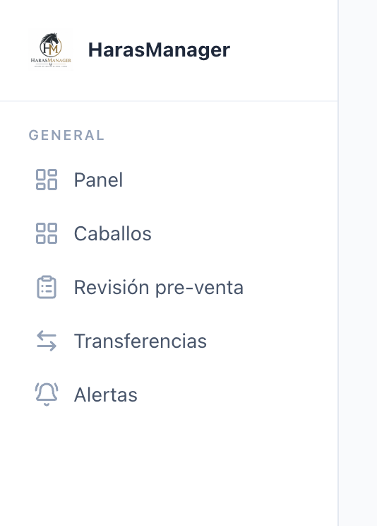

# Reu Gero - Facu - Tomi  
  
  
**++Sanidad++**: Yegua preñada: dosis de vacunas. 3 dosis de una vacuna, otra vacuna, etc.   
  
En la primer etapa de la cría se reconoce por numero  
  
Muchas vacunas todas mezcladas y para distintos caballos  
  
Listar por “próximas aplicaciones” por fecha. Las mas próximas primero  
  
  
Registro de trabajo por dia por veterinario. Ver como hacerlo.   
  
  
Recordatorio: Muerta/baja  
  
  
Plan sanitario: 
  
- Para yegua preñada  
- De recria  
  
  
Trabajos: los que hay que hacer desde antes vs. los que surgen/extras.   
  
RP —> numero de identificación  
  
Nombre —> Algunos caballos también tienen nombre.   
  
  
Para nueva consulta poner para seleccionar el caballo desde vet empresa // nombre // camada // caballo  
  
  
Trabajo para mas de un caballo.   
  
  
Ver como hacer para caballo  
  
  
Modificar filtro para ver caballos desde admin  
  
Sacar transferencias  
  
Si solo tiene admin general activado sacarle todo lo que tiene que ver con centro de cría  
  
Para general trabajos de sanidad y trabajos normales  
  
  
Agregar trabajos acá desde vet y dentro de esto próximas consultas  
  
Tener en cuenta yeguas preñadas para admin general  
  
Armar tarjetas por tipo de trabajo bien visual  
  
  
**++Centro de embriones

++RECEPTORA**  
  
1. **Llegó Receptora**  
**    		↓**  
2. **Revisión**  
**    		↓**  
3. **Registrar valores foliculares**  
**		↓**  
4. **Revisiones diarias**  
**    		↓**  
5. **¿Ovuló?**  
**    ├─ NO**  
**    │    ↓**  
**    │  Continúa revisiones diarias**  
**    │**  
**    └─ SI**  
**         ↓**  
**      Registrar OV**  
**         ↓**  
**      ¿Tamaño adecuado?**  
**         ├─ NO**  
**         │     ↓**  
**         │   Strelling u Ovusynch**  
**         │     ↓**  
**         │   Crear alerta (X horas configurable)**  
**         │     ↓**  
**         │   Volver a Revisión**  
**         │**  
**         └─ SI**  
**                ↓**  
**           Día 3 a Día 7 desde OV**  
**                ↓**  
**           Disponible para recibir embrión**  
**                ↓**  
**           ¿Recibió transferencia?**  
**                ├─ NO**  
**                │     ↓**  
**                │    PG**  
**                │     ↓**  
**                │    Revisar en 4 días**  
**                │     ↓**  
**                │    Volver a Revisión**  
**                │**  
**                └─ SI**  
**                       ↓**  
**                  Transferencia**  
**                       ↓**  
**                  Registrar:**  
**                    - Fecha transferencia**  
**                    - Embrión recibido**  
**                    - Donante**  
**                    - Padrillo**  
**                    - Características del embrión**  
**                       ↓**  
**                  Crear alertas:**  
**                    - Eco 1 (X días)**  
**                    - Eco 2 (X días)**  
**                    - Eco 3 (X días)**  
**                       ↓**  
**                  ECO 1**  
**                       ↓**  
**                  ¿Resultado?**  
**                    ├─ Abortado**  
**                    │     ↓**  
**                    │   Lista Vacías**  
**                    │     ↓**  
**                    │   Volver a Revisión**  
**                    │**  
**                    └─ Preñada**  
**                          ↓**  
**                     Lista Preñadas**  
**                          ↓**  
**                        ECO 2**  
**                          ↓**  
**                     ¿Resultado?**  
**                       ├─ Abortado → Lista Vacías → Revisión**  
**                       │**  
**                       └─ Preñada**  
**                             ↓**  
**                           ECO 3**  
**                             ↓**  
**                     ¿Resultado?**  
**                       ├─ Abortado → Lista Vacías → Revisión**  
**                       │**  
**                       └─ Preñada**  
**                             ↓**  
**                        Registrar:**  
**                          - Sexo**  
**                          - Fecha sexado**  
**                          - Fecha probable de parto**  
**                            (Transferencia + 335,5 días)**  
**                             ↓**  
**                        Lista Preñadas**  
  
DONANTE  
  
Llegó Donante  
    ↓  
Revisión  
    ↓  
Strelling  
    ↓  
Alerta automática (configurable)  
    ↓  
Inseminación  
    ↓  
Se define Padre del Embrión  
    ↓  
Alerta automática (configurable)  
    ↓  
Oxy  
    ↓  
Revisiones diarias  
    ↓  
¿Ovuló?  
    ├─ NO  
    │    ↓  
    │  Vuelve a Strelling  
    │  
    └─ SI  
         ↓  
      OV (registrar tamaños)  
         ↓  
      Flushing  
         ↓  
      Alerta automática (configurable)  
         ↓  
      ¿Resultado Flushing?  
         ├─ NEGATIVO  
         │     ↓  
         │    PG  
         │     ↓  
         │    Revisión  
         │     ↓  
         │    Vuelve a Strelling  
         │  
         └─ POSITIVO  
                ↓  
           Registrar cantidad de embriones  
                ↓  
           Embriones heredan padrillo definido  
                ↓  
           Crear registros de embriones  
                ↓  
           Estado: Disponible para Transferencia  
                ↓  
           Esperar X días (configurable)  
                ↓  
           Vuelve a Llegó Donante  
  
CONEXIÓN CON RECEPTORA  
  
Embrión Disponible para Transferencia  
                ↓  
         Flujo de Receptora  
  
  
  
Revisión. Se tiene que hacer x dias de la semana dependiendo si es donante o receptora y se deberia poder configurar x dias de la semana para cada una.   
  
  
RECEPTORA  
Dentro de la revisión: donantes vs. Receptoras. (CLV: Ovuló y pasaron xls.). Se revisan los ovarios folículos izq/der. Se revisa el utero (C/T (sin tono; Niveles de edema ED 1 2 3 y liq nivel de liquido (+ ++ +++). Acciones: Strelin (inductor). A LA RECEPTORA no se insemina ni se hace flushing. Oxi es contraer el utero. PG reinicia el ciclo. 1PG para levantar edema . Los tratamientos/acciones del registro reproductivo sean configurables. Revisar mañana esta bueno tenerlo  
  
Alertas configurables para cada acción.   
  
  
Cuando tocas flushing que aparezca la opción de flushing  
  
Cuando cargas el flushing que aparezca o las receptoras ya ovaladas ordenadas de dias despues de la ovulaciónn de la receptora en ese orden (+1 +2 etc). Ver   
  
Puede haber mas de un embrion. Embrion 1 —> receptora tal. Embrion 2 —> receptora tal.   
  
  
Embrion vitrificado se ven desde embriones y hay que poder transferirlos a una receptora.   
  
  
En embriones que haya transferidos y ahi puedas agregar ecografía en receptora. Ecografía vacía // preñada // revisar en x dias.   
  
Vacia a los x dias se tiene que empezar a revisar. 

Preñada >> en config si se hace o no eco 2 y a los x dias. 

Eco 2 preñada o vacía.

Eco 3 sexado. A los x dias. H // M // vacia // aborta. H o M.   
  
Puede haber 1 o 2 ecos mas, ver como agregar configurable.   
  
Se hace a los x dias desde transferencia + x dias desde ovulación a flushing configurables. 

Aborta dispara a yeguas a abortar.   
  
Llevarnos para ver arquitectura de configurables.   
  
Ver dias de preñada.   
  
